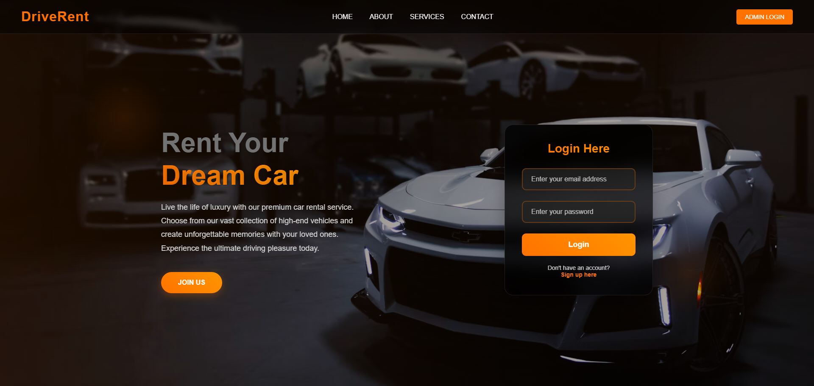

🚗 DriveRent - Car Rental Website Project

 
Welcome to the DriveRent! This application provides a comprehensive platform for users to browse, reserve, and return vehicles, complemented by an administrative interface for efficient fleet and user management.

✨ Key Features
User Authentication: Secure login for seamless access.

Dynamic Car Listings:

Browse an up-to-date catalog of available cars.

Powerful search functionality to quickly find desired vehicles.

Only currently available cars are displayed to users.

Effortless Reservations:

Reserve cars with ease.

Track and view all your active reservations.

Streamlined Returns: A dedicated process for returning rented vehicles.

Secure Payments: Integrated system for secure rental payments.

Customer Feedback: A channel for users to provide valuable feedback.

Robust Admin Panel:

Fleet Management: Add, delete, and update car details.

Reservation Control: Accept, reject, and delete user reservations.

Return Processing: Manage and process car returns.

Feedback Review: Access and review all submitted user feedback.

🛠️ Requirements
To run this project locally, you'll need:

XAMPP: The project is built to run on a localhost server powered by XAMPP.

🚀 Installation Guide
Getting started is simple! Follow these steps:

Install XAMPP: If not already installed, download and set up XAMPP.

Start Services: Open the XAMPP Control Panel and initiate the Apache and MySQL services.

Clone Repository: Clone this project into your XAMPP's htdocs directory (e.g., C:\xampp\htdocs\your-project-name\).

Database Setup:

Navigate to http://localhost/phpmyadmin in your browser.

Create a new database named Cardb.

Import the Cardb.sql file (located in the database folder of the cloned project) into your newly created Cardb database.

Launch Application: Open your web browser and visit http://localhost:8080/ (or http://localhost/ if your Apache port is default).

🗄️ Database Structure
The project utilizes a MySQL database named Cardb, with connection.php handling all database interactions.

**Note: Development of admin dashboard is still on progress**

**Made with ❤️ by Ashik**
